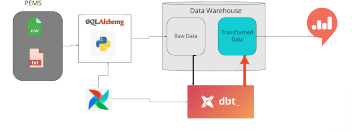

### Concepts

ETL
Introduction
The biggest problem while designing these systems is integrating one tool with another because, in real-world projects, a single system may use multiple tools for varied purposes. In this blog post, we'll look at how to create a useful pipeline that saves data in a data warehouse (Postgres) and transforms it using dbt once it's been stored. Airflow will direct the project's flow.
### Data
In Downloads - pNEUMA | open-traffic (epfl.ch) you can find pNEUMA data: pNEUMA is an open large-scale dataset of naturalistic trajectories of half a million vehicles that have been collected by a one-of-a-kind experiment by a swarm of drones in the congested downtown area of Athens, Greece. Each file for a single (area, date, time) is ~87MB of data.
You may refer to the following references to understand how the data is generated from video frames recorded with swarm drones.
- PIA15_poster.pdf (datafromsky.com)(PDF) 
- Automatic vehicle trajectory extraction for traffic analysis from aerial video data (researchgate.net)

May use the following GitHub packages to visualize and interact with the data (and obtain other similar data)

### Workflow
Tech Stack
- Airflow: Apache Airflow is an open-source workflow management platform for data engineering. In our case, we will manage the workflow of the ELT pipeline.
- Python: An object oriented programming language used to write the data extracting, loading and transforming scripts.
-DBT(Data built tool): is a data transformation tool that enables data analysts and engineers to transform, test, and document data in the cloud data warehouse.
- PostgreSQL: is a free and open-source relational database management system emphasizing extensibility and SQL compliance.
- Redash: Redash is an open source web application. It’s used for clearing databases and visualizing the results.
 
### Setup - Official Version
 (For the section on the Custom/Lightweight setup, scroll down)

 #### Setup
  [Airflow Setup with Docker, through official guidelines](1_setup_official.md)

 #### Execution
 
  1. Build the image (only first-time, or when there's any change in the `Dockerfile`, takes ~15 mins for the first-time):
     ```shell
     docker-compose build
     ```
     or (for legacy versions)
     ```shell
     docker build .
     docker build . --tag apache_dbt/airflow:2.3.3
     ```
 2. Initialize the Airflow scheduler, DB, and other config
    ```shell
    docker-compose up airflow-init
    ```

 3. Kick up the all the services from the container:
    ```shell
    docker-compose up
    ```

 4. In another terminal, run `docker-compose ps` to see which containers are up & running (there should be 7, matching with the services in your docker-compose file).

 5. Login to Airflow web UI on `localhost:8080` with default creds: `airflow/airflow`

 6. Run your DAG on the Web Console.

 7. On finishing your run or to shut down the container/s:
    ```shell
    docker-compose down
    ```

    To stop and delete containers, delete volumes with database data, and download images, run:
    ```
    docker-compose down --volumes --rmi all
    ```
    or
    ```
    docker-compose down --volumes --remove-orphans
    ```
  8. In another terminal, run `docker ps` to see which containers are up & running (there should be 3, matching with the services in your docker-compose file).

  9. Login to Airflow web UI on `localhost:8080` with creds: `admin/admin` (explicit creation of admin user was required)

  10. Run your DAG on the Web Console.

  11. On finishing your run or to shut down the container/s:
    ```shell
    docker-compose down
    ```
### Future Enhancements
* Deploy self-hosted Airflow setup on Kubernetes cluster

### References
For more info, check out these official docs:
   * https://airflow.apache.org/docs/apache-airflow/stable/start/docker.html
   * https://airflow.apache.org/docs/docker-stack/build.html
   * https://airflow.apache.org/docs/docker-stack/recipes.html
### Author
* Name: Birhanu Gebisa
* Email:birhanugebisa@gmail.com
* Github:https://github.com/BirhanuGebisa